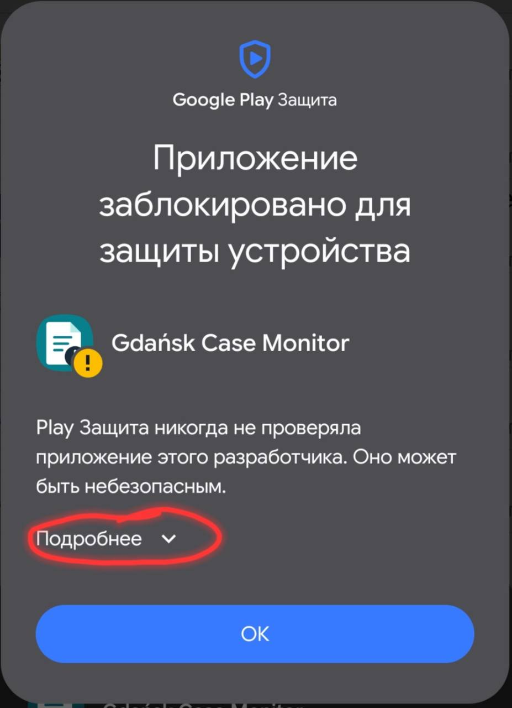
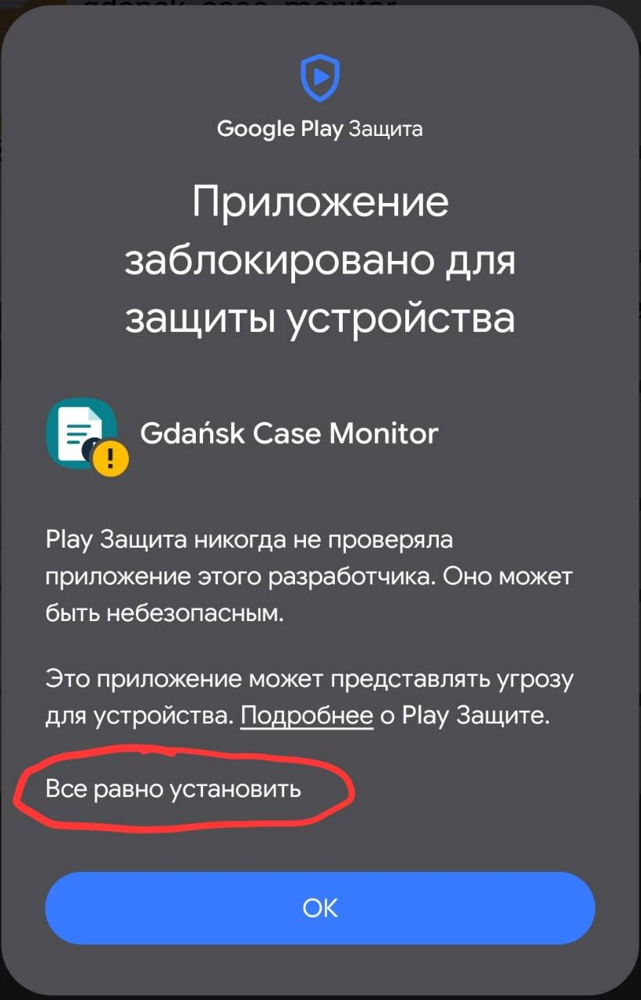
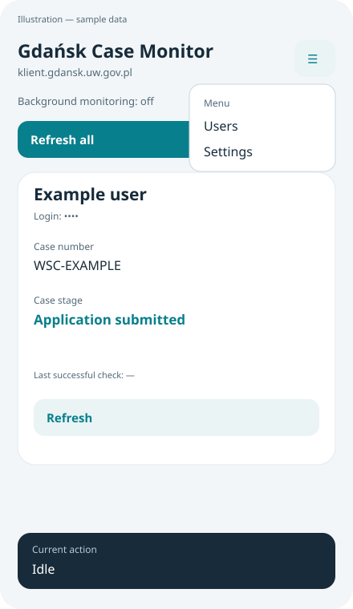
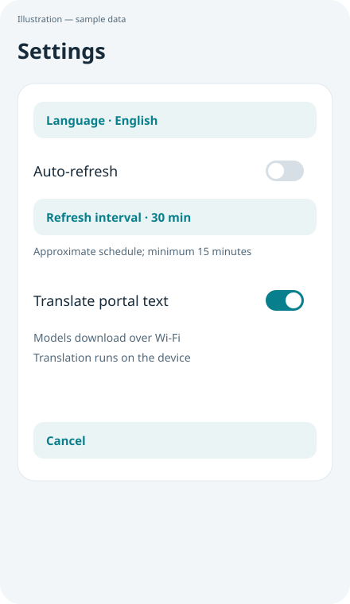
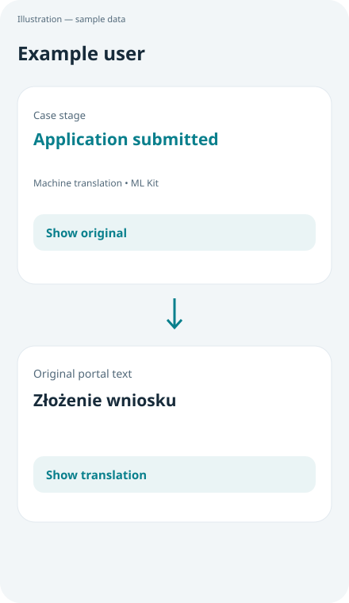

# Gdańsk Case Monitor — User Guide

Android application, version 1.2.1 · 2 October 2026

[Русская версия](USER_GUIDE_RU.md)

## 1. About the application

Gdańsk Case Monitor checks case information on `https://klient.gdansk.uw.gov.pl/` for one or more saved accounts. You can check cases manually or enable background checks. Optional on-device translation displays selected portal text in the application language.

The application displays information supplied by the portal. It does not submit applications, change your case or replace the portal as the source of information.

Application illustrations in this guide are schematic; all illustrated account details are fictional and example translations are illustrative. The Play Protect installation section includes two actual user-provided screenshots. Layout and wording may differ on your phone.

## 2. Requirements and installation

You need:

- Android 8.0 or later.
- A valid portal login and password for each account.
- Internet access to check cases.
- Wi-Fi and available storage to download translation models, if you enable translation.

To install:

1. Obtain the release APK from a trusted source.
2. Open the APK on your phone and follow the Android installation prompts.
3. If required, allow the app opening the APK to install applications from that source. Android wording varies by device.
4. Open **Gdańsk Case Monitor**.
5. Allow notifications if you want background case-change alerts. On Android 13 or later, the application requests this permission.

Android or Play Protect may warn about an unfamiliar application. A release signature does not guarantee that these warnings disappear. Verify the APK source before proceeding; do not disable device-wide security protection simply to install it.

### Google Play Protect warning during installation

The screenshots below show an installation-blocked warning explaining that Play Protect has not previously checked apps from this developer. This is not proof that the APK is safe and is not a reason to dismiss the warning automatically. A release signature does not mean that Google has reviewed the application.

Proceed only if you deliberately intend to install **Gdańsk Case Monitor**, obtained the APK from a trusted source, and verified its origin. If needed, compare the file's SHA-256 with the entry for this release in `release/SHA256SUMS`, obtained from a trusted source. A matching checksum confirms that the file matches that release, but does not itself prove safety.

1. Check the application name and warning text. Cancel if you did not expect the installation, the source is unknown, or the checksum does not match.
2. For the warning variant shown here, tap **More details** (Russian screenshot: **Подробнее**) to expand the available actions. English wording may vary.

3. Reconsider the risk. Only if you trust the verified APK and accept that risk, tap **Install anyway** (Russian screenshot: **Все равно установить**).

4. Follow the remaining Android installer prompts. The **OK** button in the pictured warning does not itself mean that installation will continue.

**Do not switch off Play Protect globally.** If there is no Install anyway option, the device is managed by an organization, or the warning identifies malware, data theft, or another specific threat, stop and contact the APK provider or device administrator. Do not try to bypass that block. Wording and available actions depend on the Android version, Play Protect, and device policies.

These are actual user-provided screenshots with Russian system text; the other illustrations in this guide are schematic and use fictional data. For general information about checks and warnings, see [Google Play Protect Help](https://support.google.com/googleplay/answer/2812853?hl=en).

### Updating an existing installation

Install the new release APK over the existing release installation. Releases 1.0.2 through 1.2.1 use the same signing key and support this update path without deleting saved accounts.

If Android reports incompatible signatures, do not immediately uninstall the application. Earlier debug builds may use a different key. Uninstalling or clearing application storage deletes local accounts and saved results; you will need to enter credentials again.

## 3. Quick start

1. Open **☰ → Users → + User**.
2. Enter a **Name / label**, the portal **Login / case number**, and **Password**. Use the identifier you actually use to sign in to the portal, not necessarily the reference shown on the case page.
3. Tap **Save**.
4. Tap **Refresh all** on the main screen.
5. Wait for the check to finish and review the account card. Keep the application open while testing your first manual check.

The first launch uses English, regardless of your phone language. Auto-refresh and portal-text translation are off by default; the default refresh interval is 30 minutes.

## 4. Main screen and current action

The main screen contains:

- **☰ menu:** account management and settings.
- **Background monitoring:** whether automatic checks are enabled and the configured interval.
- **Refresh all:** a manual check of saved accounts, performed sequentially.
- **Account cards:** account name, masked login, case information and last successful check time.
- **Refresh:** a manual check of the account on that card.
- **Current action:** the operation currently running, fixed at the bottom of the screen.

Cards can show name and surname, case number, application date, case stage, stage description, notes and documents. Empty fields may be omitted. “Documents” is portal text; the application does not offer document-file downloads. Long-press a displayed field value to select and copy it.

The bottom status uses these labels:

| Label | Meaning |
| --- | --- |
| Idle | No tracked portal check or translation is currently running. Auto-refresh can still be enabled. |
| Starting request | The application is preparing a portal check. |
| Connecting to portal | The portal page is being requested. |
| Loading page | The page or login form is loading. |
| Signing in | The application is waiting for or processing the login form. |
| Reading case data | The application is waiting for and extracting case information. |
| Saving results | The check result is being saved locally. |
| Preparing translation models (Wi-Fi) | The translator is checking or downloading required models; downloads require Wi-Fi. |
| Translating on device | Text is being processed locally. |

Short phases may pass too quickly to be visible. This is not a percentage-complete indicator. When a portal check and translation overlap, portal progress takes priority. The bar also shows background checks running in the current application process while the screen is open.

**Check completed** means that the check has finished, not that every account succeeded. Inspect each card for errors. After a failed check, a card may retain earlier successful data: always check **Last successful check** and any error message before treating it as current information.

## 5. Manage users

### Add a user

Open **☰ → Users → + User**, enter a display name, portal login and password, then tap **Save**. The display name is a local label; it need not match the name on the portal. You can also add your first account from the empty-state button on the main screen.

### Edit a user

1. Open **☰ → Users**.
2. Select the account name, then **Edit**.
3. Update its name, login or password.
4. Leave the new-password field blank to keep the current password.
5. Tap **Save**, then **Refresh** on its card to check the new credentials.

### Delete a user

Open **☰ → Users**, select the account, choose **Delete**, and confirm. This removes that account's saved credentials and results from the application. It does not delete the account or case on the portal. There is no undo; you can add the account again if you know its credentials.

Account changes and language changes are blocked while a portal check is running. Wait for it to finish and try again.

## 6. Settings and language

Open **☰ → Settings**. The available settings are **Language**, **Auto-refresh**, **Refresh interval**, **Translate portal text**, and **Protect screen (block screenshots)**.

Screen protection is off by default. When enabled, Android is instructed to prevent screenshots, screen recording on non-secure outputs, and task previews of the main window and dialogs. Device behavior can vary. This does not prevent photographing the screen with another device or access through a compromised device. Turn the setting off if you deliberately need to share a redacted screenshot.

Settings take effect immediately and are saved locally. The **Cancel** button closes the settings window; it does not undo changes already made.

To change the language, tap **Language** and select a language. The main screen reloads automatically; account data is preserved. The selection applies to the application, not to the phone or portal website.

Available languages: English, Russian, Polish, Ukrainian, German, French, Spanish, Portuguese, Chinese, Japanese, Arabic and Hindi. Arabic uses a right-to-left layout.

Interface language and portal-text translation are separate settings. Changing the interface language alone does not translate portal content. Some old error messages saved by earlier releases retain their original language until another check replaces them.

## 7. Automatic checks and notifications

1. Open **☰ → Settings**.
2. Tap **Refresh interval** and choose a period.
3. Turn **Auto-refresh** on.
4. Return to the main screen and confirm that background monitoring is shown as on.

Available intervals are 15, 30, 60, 180, 360, 720 and 1440 minutes. Changing the interval updates the existing background schedule. Turning **Auto-refresh** off cancels future scheduled checks; an already running check may finish.

Checks require network access. Android controls background execution, so intervals are approximate: lack of connectivity, battery saving or system restrictions can delay a check. This is not continuous or real-time monitoring. You can still use **Refresh** with auto-refresh off.

During background monitoring, the application posts a notification when newly received case values differ from the previous successful result. The first successful check establishes a reference and does not generate a change alert. Changes to interface labels or the translation setting do not count as changes to the case.

Enable application notifications in Android settings if needed. From version 1.2.1, background notifications only report that case information changed; names and case text are not included. Tap the notification to open the application and review details. Manual checks update cards; they do not send the background change notification.

## 8. Translate portal text

1. Select the desired application language in **☰ → Settings → Language**.
2. Connect to Wi-Fi.
3. Turn **Translate portal text** on.
4. Return to an account card with successfully retrieved data and wait for model preparation and translation.

Translation uses Google ML Kit on the device, not the Google Translate website or Cloud Translation API. No API key or Cloud Translation account is required. Models take approximately 30 MB per language; more than one model may be needed. Once the required models are available, translation can run locally without downloading them again. Retrieving fresh portal information still requires internet access.

The application translates the case stage, stage description, notes and documents text. It does not translate the dedicated name, case-number or application-date fields, and does not pass login credentials to the translator. Names or dates that appear inside free-text notes are part of that text and may be processed.

After a successful translation, tap **Show original** to compare it with the portal text. Tap **Show translation** to switch back. The original saved result remains unchanged; translation does not affect case-change detection or the portal itself. Translated output is cached only in memory for the current screen instance, not saved as a replacement for the original.

If model preparation or translation fails, or takes longer than two minutes, the card displays the original text and an explanatory message. Connect to Wi-Fi and retry with **Refresh**, or switch translation off and on in settings.

The source language is detected automatically. For short text that cannot be identified, the application assumes Polish. Machine translation may be inaccurate; always compare important wording with the original portal text. Translation is a reading aid, not an authoritative interpretation of your case.

## 9. Privacy and storage

- Saved credentials and portal results are encrypted locally using Android Keystore.
- To check a case, the application sends that account's credentials to the HTTPS portal. It is therefore not an entirely offline application.
- Login display on the main screen is masked. Other case information remains visible on cards; change notifications do not contain names or case text.
- Backup and device-to-device transfer of private application data are explicitly excluded. WebView cookies are cleared before and after checks; DOM storage and cache are cleared as well.
- Portal text is translated on the device rather than sent for cloud translation. Google ML Kit may communicate with Google for model downloads and service-related data.
- Removing a local user does not change the portal account. Uninstalling the application or clearing its storage removes local accounts, settings and saved results.

Version 1.2.1 has no user-facing account export or import function. Do not rely on an APK update as a backup of your portal credentials.

## 10. Troubleshooting

| Problem | What to do |
| --- | --- |
| Not checked yet | Tap **Refresh** or **Refresh all**. |
| Storage unavailable | Existing encrypted data has been preserved; checks and account changes are blocked to prevent overwriting it. Do not clear app storage or reinstall. Restart the device and contact support if the problem persists. |
| A check is still running | Wait for the current check to finish. Checks are not run in parallel. |
| Request timed out / network error | Check connectivity and open the portal in a browser. Update Android System WebView if necessary, then retry. |
| Portal HTTP error | The portal returned an HTTP error. Try again later; check whether the website is available in a browser. |
| Login rejected | Verify the portal login and password in a browser. Correct the saved account through **Users → account → Edit**. |
| CAPTCHA or verification code required | Complete the required interaction directly in the portal browser. The application cannot bypass it or import the browser's authenticated session; automatic checks may remain unavailable. |
| Certificate error | Check the phone's date and time; update the application and Android System WebView. If the error persists, do not bypass certificate validation: check portal availability and report the error. |
| Cannot start WebView | Update or enable Android System WebView through the device's supported update mechanism and retry. |
| Redirect to another website | The application stops login outside the expected HTTPS portal. Check the address and report the error rather than submitting credentials to an unfamiliar site. |
| Translation unavailable | Connect to Wi-Fi, check available storage, then refresh or toggle translation off and on. The original remains available. |
| Background checks or alerts are delayed | Confirm auto-refresh is on, internet access is available and Android permits background activity and notifications for this application. Scheduled times are not exact. |
| Data not recognized | Compare with the portal in a browser. The portal page structure may have changed; an application update may be needed. |

For support, record the application version, Android version, visible error text, whether the check was manual or automatic, and the last successful check time. Redact names, logins, case numbers and case text from screenshots. Never send a password, local secret files or signing keys.

## 11. Practical limits

Version 1.2.1 does not provide exact-time scheduling, CAPTCHA/MFA automation, document downloads, account export/import or cloud translation. The layout, model-download flow and security controls require confirmation on a physical Android device; this guide describes the implemented behavior, not a claim of complete device testing.
