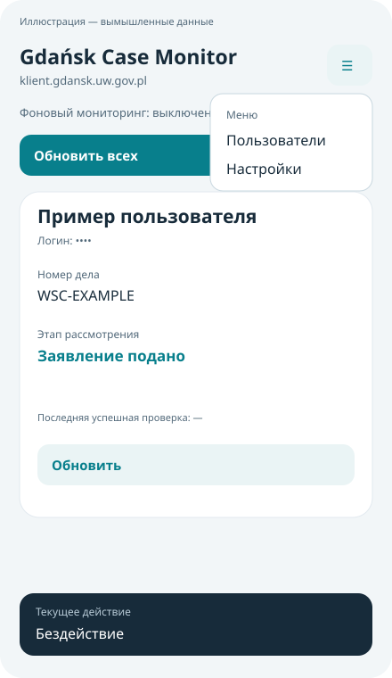
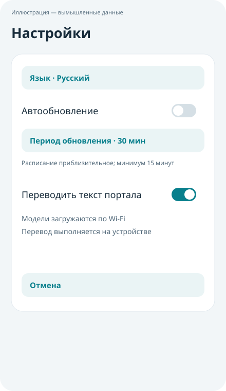
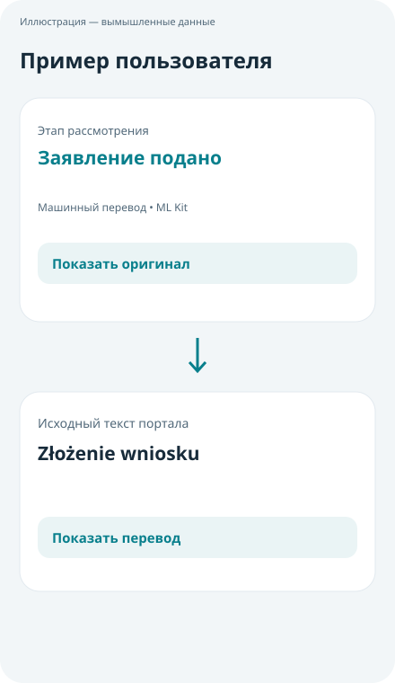

# Gdańsk Case Monitor — руководство пользователя

Приложение для Android, версия 1.2.1 · 2 октября 2026 года

[English version](USER_GUIDE_EN.md)

## 1. Назначение приложения

Gdańsk Case Monitor проверяет сведения о делах на портале `https://klient.gdansk.uw.gov.pl/` для одной или нескольких сохранённых учётных записей. Можно запускать проверки вручную, включать фоновое автообновление и переводить отдельные тексты портала на язык приложения.

Приложение показывает сведения, предоставленные порталом. Оно не подаёт заявления, не изменяет ваше дело и не заменяет портал как источник информации.

Иллюстрации приложения в руководстве — схемы с вымышленными данными пользователей; примеры перевода приведены для пояснения. Раздел установки с предупреждением Play Защиты содержит два реальных скриншота, предоставленных пользователем. Компоновка и формулировки на вашем устройстве могут отличаться.

## 2. Требования и установка

Вам понадобятся:

- Android 8.0 или новее.
- Действующие логин и пароль портала для каждого пользователя.
- Интернет для проверки дел.
- Wi-Fi и свободное место для загрузки моделей, если вы включите перевод.

Для установки:

1. Получите release APK из доверенного источника.
2. Откройте APK на телефоне и следуйте указаниям Android.
3. Если потребуется, разрешите приложению, через которое открыт APK, установку из этого источника. Названия системных пунктов зависят от устройства.
4. Запустите **Gdańsk Case Monitor**.
5. Разрешите уведомления, если хотите получать сообщения об изменении дел при фоновых проверках. На Android 13 и новее приложение запрашивает это разрешение.

Android или Play Защита могут показать предупреждение о неизвестном приложении. Release-подпись не гарантирует исчезновения таких предупреждений. Перед установкой проверьте источник APK; не отключайте защиту всего устройства только ради установки.

### Предупреждение Google Play Защиты при установке

На приведённых ниже скриншотах показано предупреждение «Приложение заблокировано для защиты устройства» с пояснением, что Play Защита ещё не проверяла приложения этого разработчика. Это не подтверждение безопасности APK и не основание автоматически игнорировать предупреждение. Наличие release-подписи тоже не означает, что Google проверил приложение.

Продолжайте только если вы сами намеренно устанавливаете **Gdańsk Case Monitor**, получили APK из доверенного источника и проверили его происхождение. При необходимости сравните SHA-256 файла с записью для этой версии в `release/SHA256SUMS`, полученной из доверенного источника. Совпадение подтверждает соответствие файлу релиза, но само по себе не доказывает его безопасность.

1. Проверьте название приложения и текст предупреждения. Если вы не ожидали установку, источник неизвестен или контрольная сумма не совпадает, отмените установку.
2. Для показанного варианта предупреждения нажмите **Подробнее**, чтобы раскрыть дополнительные действия.

3. Ещё раз оцените риск. Только если вы доверяете проверенному APK и принимаете этот риск, нажмите **Всё равно установить** (на скриншоте — «Все равно установить»).

4. Следуйте оставшимся указаниям установщика Android. Кнопка **OK** в показанном предупреждении сама по себе не означает продолжение установки.

**Не отключайте Play Защиту целиком.** Если пункта «Всё равно установить» нет, устройство управляется организацией или предупреждение явно сообщает о вредоносном приложении, краже данных либо другой конкретной угрозе, остановитесь и обратитесь к поставщику APK или администратору устройства. Не пытайтесь обходить такую блокировку. Текст и доступные действия зависят от версии Android, Play Защиты и правил устройства.

Скриншоты выше реальные и показывают русский системный интерфейс; остальные иллюстрации в руководстве — схемы с вымышленными данными. Общие сведения о проверках и предупреждениях: [справка Google Play Защиты](https://support.google.com/googleplay/answer/2812853?hl=ru).

### Обновление установленной версии

Установите новый release APK поверх существующей release-версии. Версии 1.0.2–1.2.1 подписаны одним ключом и допускают такое обновление с сохранением аккаунтов.

Если Android сообщает о несовместимой подписи, не спешите удалять приложение. Старые debug-сборки могли использовать другой ключ. Удаление приложения или очистка его хранилища удалит локальные аккаунты и сохранённые результаты: логины и пароли придётся ввести заново.

## 3. Быстрый старт

При первом запуске интерфейс английский, независимо от языка телефона. Автообновление и перевод текста портала по умолчанию выключены; начальный период обновления — 30 минут.

Чтобы перейти на русский язык, откройте **☰ → Settings → Language → Русский**. После этого используйте русские названия пунктов ниже.

1. Откройте **☰ → Пользователи → + Пользователь**.
2. Заполните **Имя / метка**, **Логин / номер дела** и **Пароль**. Указывайте именно идентификатор, с которым входите на портал: он не обязательно совпадает с номером, показанным на странице дела.
3. Нажмите **Сохранить**.
4. На главном экране нажмите **Обновить всех**.
5. Дождитесь завершения и проверьте карточку пользователя. При первой ручной проверке оставьте приложение открытым.

## 4. Главный экран и текущее действие

На главном экране расположены:

- **Меню ☰:** управление пользователями и настройки.
- **Фоновый мониторинг:** включено ли автообновление и какой период выбран.
- **Обновить всех:** ручная последовательная проверка сохранённых пользователей.
- **Карточки пользователей:** имя, замаскированный логин, сведения о деле и время последней успешной проверки.
- **Обновить:** ручная проверка пользователя на выбранной карточке.
- **Текущее действие:** закреплённая внизу строка выполняемой операции.

В карточке могут отображаться имя и фамилия, номер дела, дата подачи заявления, этап рассмотрения, описание этапа, примечания и документы. Пустые поля могут не отображаться. «Документы» — текстовое поле портала; функции скачивания файлов документов нет. Для выделения и копирования значения нажмите на него и удерживайте.

Значения нижней строки:

| Надпись | Значение |
| --- | --- |
| Бездействие | Сейчас нет отслеживаемой проверки портала или перевода. При этом автообновление может быть включено. |
| Старт запроса | Приложение готовит проверку портала. |
| Подключение к порталу | Запрашивается страница портала. |
| Загрузка страницы | Загружается страница или форма входа. |
| Вход в систему | Приложение ожидает или обрабатывает форму входа. |
| Получение данных дела | Приложение ожидает и извлекает сведения о деле. |
| Сохранение результатов | Результат проверки сохраняется на устройстве. |
| Подготовка моделей перевода (Wi-Fi) | Проверяются или загружаются необходимые модели; загрузка требует Wi-Fi. |
| Перевод на устройстве | Текст обрабатывается локально. |

Некоторые этапы проходят слишком быстро, чтобы их заметить. Эта строка не показывает процент готовности. Если одновременно выполняются проверка портала и перевод, приоритет имеет проверка. При открытом экране строка также показывает фоновые проверки в текущем процессе приложения.

Сообщение **Проверка завершена** означает окончание проверки, а не успех для всех пользователей. Проверьте ошибки в каждой карточке. После неудачного запроса могут оставаться данные предыдущей успешной проверки: перед использованием сведений проверьте время **Последней успешной проверки** и сообщение об ошибке.

## 5. Управление пользователями

### Добавление пользователя

Откройте **☰ → Пользователи → + Пользователь**, введите имя для отображения, логин портала и пароль, затем нажмите **Сохранить**. Имя — локальная метка; оно не обязано совпадать с именем на портале. Первую учётную запись также можно добавить кнопкой на пустом главном экране.

### Изменение пользователя

1. Откройте **☰ → Пользователи**.
2. Выберите имя пользователя, затем **Изменить**.
3. Исправьте имя, логин или пароль.
4. Если пароль менять не нужно, оставьте поле нового пароля пустым.
5. Нажмите **Сохранить**, затем **Обновить** на карточке, чтобы проверить новые данные входа.

### Удаление пользователя

Откройте **☰ → Пользователи**, выберите пользователя, нажмите **Удалить** и подтвердите действие. Его сохранённые учётные данные и результаты будут удалены из приложения. Учётная запись и дело на портале не удаляются. Отмены удаления нет; пользователя можно добавить снова, если известны его логин и пароль.

Изменение пользователей и языка блокируется на время запроса к порталу. Дождитесь окончания проверки и повторите действие.

## 6. Настройки и язык

Откройте **☰ → Настройки**. Доступны **Язык**, **Автообновление**, **Период обновления**, **Переводить текст портала** и **Защита экрана (запрет скриншотов)**.

Защита экрана по умолчанию выключена. При включении Android получает указание блокировать скриншоты, запись на незащищённые экраны и превью главного окна и диалогов в списке последних приложений. Поведение зависит от устройства. Это не защищает от фотографирования другим устройством или доступа через взломанный телефон. Если нужно намеренно поделиться обезличенным скриншотом, выключите настройку.

Изменения применяются сразу и сохраняются локально. Кнопка **Отмена** закрывает окно настроек, но не отменяет уже внесённые изменения.

Для смены языка нажмите **Язык** и выберите нужный вариант. Главный экран автоматически перезагрузится; аккаунты сохранятся. Выбранный язык относится к приложению, а не к телефону или сайту портала.

Доступны английский, русский, польский, украинский, немецкий, французский, испанский, португальский, китайский, японский, арабский и хинди. Для арабского используется расположение элементов справа налево.

Язык интерфейса и перевод текста портала — разные настройки. Смена языка сама по себе не переводит сведения портала. Старые сообщения об ошибках из предыдущих версий могут оставаться на прежнем языке до следующей проверки.

## 7. Автообновление и уведомления

1. Откройте **☰ → Настройки**.
2. Нажмите **Период обновления** и выберите интервал.
3. Включите **Автообновление**.
4. Вернитесь на главный экран и убедитесь, что фоновый мониторинг включён.

Доступны интервалы 15, 30, 60, 180, 360, 720 и 1440 минут. Смена периода обновляет существующее расписание. Выключение **Автообновления** отменяет будущие запланированные проверки; уже выполняющийся запрос может завершиться.

Для проверок нужна сеть. Фоновой работой управляет Android, поэтому время приблизительное: отсутствие интернета, энергосбережение или системные ограничения могут задержать запрос. Это не непрерывное наблюдение в реальном времени. При выключенном автообновлении ручная кнопка **Обновить** остаётся доступной.

При фоновом мониторинге приложение показывает уведомление, если новые значения дела отличаются от предыдущего успешного результата. Первая успешная проверка создаёт исходный результат для сравнения и не вызывает уведомления об изменении. Смена подписей интерфейса или настройки перевода не считается изменением дела.

При необходимости разрешите уведомления приложения в настройках Android. С версии 1.2.1 уведомление сообщает только о факте изменения, без имени и текста дела. Нажмите уведомление, чтобы открыть приложение и посмотреть подробности. Ручная проверка обновляет карточки, но не отправляет фоновое уведомление об изменении.

## 8. Перевод текста портала

1. Выберите нужный язык приложения через **☰ → Настройки → Язык**.
2. Подключитесь к Wi-Fi.
3. Включите **Переводить текст портала**.
4. Вернитесь к карточке с успешно полученными данными и дождитесь подготовки моделей и перевода.

Используется Google ML Kit на устройстве, а не сайт Google Translate и не облачный Cloud Translation API. API-ключ или аккаунт Cloud Translation не нужен. Модели занимают примерно 30 МБ на язык; может потребоваться несколько моделей. Когда нужные модели уже доступны, перевод выполняется локально без их повторной загрузки. Для получения новых сведений с портала интернет по-прежнему необходим.

Переводятся этап рассмотрения, описание этапа, примечания и текст документов. Отдельные поля имени, номера дела и даты подачи заявления не переводятся; данные входа не передаются переводчику. Имена или даты, встречающиеся внутри свободного текста примечаний, являются частью этого текста и могут обрабатываться.

После успешного перевода нажмите **Показать оригинал**, чтобы свериться с текстом портала. Кнопка **Показать перевод** вернёт переведённый вариант. Исходный сохранённый результат не меняется; перевод не влияет на обнаружение изменений дела и не изменяет портал. Перевод кэшируется только в памяти текущего экземпляра экрана и не сохраняется вместо оригинала.

Если подготовка моделей или перевод завершается ошибкой либо длится более двух минут, карточка показывает оригинал и пояснение. Подключитесь к Wi-Fi и повторите попытку кнопкой **Обновить** либо выключите и снова включите перевод в настройках.

Исходный язык определяется автоматически. Для короткого текста, язык которого определить не удалось, приложение предполагает польский. Машинный перевод может ошибаться: важные формулировки всегда сверяйте с оригиналом. Перевод помогает читать текст, но не является официальным толкованием сведений о деле.

## 9. Конфиденциальность и хранение

- Сохранённые логины, пароли и результаты зашифрованы на устройстве с использованием Android Keystore.
- Для проверки приложение отправляет данные входа соответствующего пользователя на HTTPS-портал. Поэтому оно не является полностью офлайн-приложением.
- Логин на главном экране замаскирован. Другие сведения остаются видимыми в карточках; уведомления об изменении не содержат имени или текста дела.
- Резервное копирование и перенос приватных данных приложения между устройствами явно запрещены. Cookies WebView очищаются до и после проверок; DOM-хранилище и кэш также очищаются.
- Текст переводится на телефоне, а не отправляется для облачного перевода. Google ML Kit может связываться с Google для загрузки моделей и обмена служебными данными.
- Удаление локального пользователя не меняет его аккаунт на портале. Удаление приложения или очистка его хранилища удаляет локальные аккаунты, настройки и результаты.

В версии 1.2.1 нет пользовательской функции экспорта и импорта аккаунтов. Не считайте обновление APK резервной копией своих данных входа на портал.

## 10. Устранение ошибок

| Ситуация | Что сделать |
| --- | --- |
| Хранилище недоступно | Данные сохранены; проверки и изменения аккаунтов заблокированы. Не очищайте данные и не переустанавливайте приложение. Перезагрузите устройство; если ошибка остаётся, обратитесь за помощью. |
| Еще не проверялось | Нажмите **Обновить** или **Обновить всех**. |
| Проверка еще выполняется | Дождитесь завершения текущего запроса. Параллельные проверки не запускаются. |
| Истекло время ожидания / ошибка сети | Проверьте подключение и откройте портал в браузере. При необходимости обновите Android System WebView, затем повторите запрос. |
| Ошибка HTTP | Портал вернул HTTP-ошибку. Повторите позже и проверьте доступность сайта в браузере. |
| Вход отклонен | Проверьте логин и пароль в браузере. Исправьте данные через **Пользователи → имя → Изменить**. |
| Требуется CAPTCHA или код подтверждения | Выполните необходимое действие непосредственно на портале в браузере. Приложение не обходит проверку и не импортирует авторизованную сессию браузера; автоматические запросы могут остаться недоступными. |
| Ошибка сертификата | Проверьте дату и время телефона, обновите приложение и Android System WebView. Если ошибка остаётся, не обходите проверку сертификата: проверьте доступность портала и сообщите об ошибке. |
| Не удалось запустить WebView | Обновите или включите Android System WebView штатным способом для вашего устройства и повторите запрос. |
| Перенаправление на другой сайт | Приложение останавливает вход вне ожидаемого HTTPS-портала. Проверьте адрес и сообщите об ошибке; не вводите данные на незнакомом сайте. |
| Перевод недоступен | Подключитесь к Wi-Fi, проверьте свободное место и обновите данные либо выключите и включите перевод. Оригинал остаётся доступным. |
| Фоновые проверки или уведомления задерживаются | Убедитесь, что автообновление включено, есть интернет, а Android разрешает приложению фоновую работу и уведомления. Расписание не гарантирует точного времени. |
| Данные не распознаны | Сверьтесь с порталом в браузере. Возможно, структура страницы изменилась и требуется обновление приложения. |

При обращении за помощью укажите версию приложения, версию Android, видимый текст ошибки, тип проверки — ручная или автоматическая — и время последней успешной проверки. На скриншотах скройте имена, логины, номера дел и тексты сведений. Никогда не отправляйте пароль, локальные файлы секретов или ключи подписи.

## 11. Ограничения

В версии 1.2.1 нет точного расписания по часам, автоматизации CAPTCHA/MFA, скачивания документов, экспорта и импорта аккаунтов или облачного перевода. Компоновку, загрузку моделей и меры защиты необходимо дополнительно проверить на физическом Android-устройстве; руководство описывает реализованное поведение, а не подтверждает полное тестирование на телефонах.
